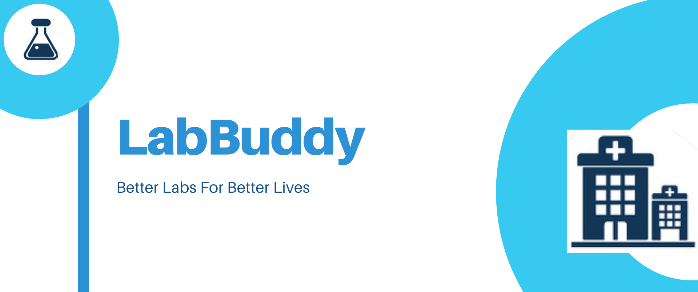
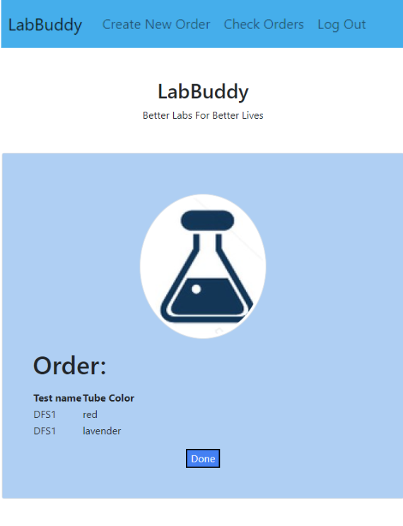

# Rocket Academy Coding Bootcamp: Project 2 LabBuddy

LabBuddy is a full-stack web app that assist with patient registration and specimen reception process, allowing users to correctly identify which specimen tube to use for specific diagnostic test.\
Currently target users for the app are clinics and small labs.

## Features
* User login with password
* Clinic users can enter patient demographic information into the patient database
* Clinic users can create a new order (for a specific diagnostic test)
* Clinic users can see which test tubes to use based on the specific diagnostic tests ordered
* Clinic users can check the orders that she/he has placed

## Demo
Here is a demo of the app:

## Screenshots

## Technologies
* JavaScript
* Node JS
* Express
* HTML
* CSS
* Bootstrap
* PostgreSQL

## Installation
In the project directory, you can run:

### `nodemon index.js`

Runs the app in the development mode.\
Open [http://localhost:3004/login](http://localhost:3004/login) to view it in the browser.

## Future Development
* Use React components for better UI/UX
* Convert the app into a PWA
